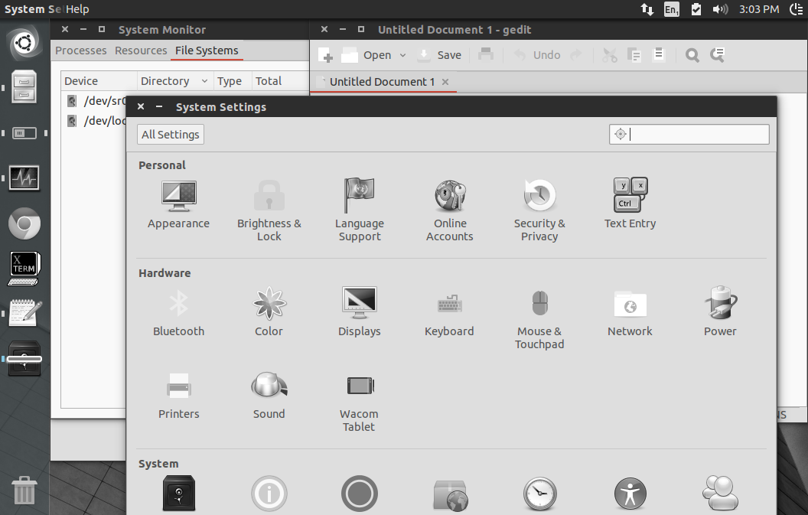

# My workflow

General:

* `vim` : text editor
* `bash/zsh/fish` : Shells, used interchangibly depending on platform. Fish
  generates completions from man pages!
* `tmux` : Terminal multiplexer
* `git` : version control
* `ack` : grep alternative for rebasing and source code exploration

Specific:

* `ipython` : interactive python shell
* `ansible` : idempotent, agentless deployment
* `httpie` : curl alternative with better UX
* `ncdu` : hunt for disk usage

# shell

* `tm` will start or attach to the first `tmux` session. If you're on the only shell, `tmux` session 0 will automatically attach.
* `CTRL+p` will launch `vim` in find mode.
* `CTRL+s` will prepend `sudo` to the prompt and move the cursor to the end of the prompt
* `tryforever <cmd...>` will run a command in a loop until it fails
* history is synchronised between open shells

See `home/.aliases` and `bin/` for some useful shortcuts.

# Dotfiles
Run `install.sh` to install to your home directory, **overwriting all required
files.** If you run it as root, it will install to `/etc/skel` so that new
users get a copy.

The `master` branch installs a version which is not user-specific. Create a
branch with the same name as your username to add user-specific things such as
git email configuration and authorised keys.

Menlo/Meslo/Consolas is the recommended font. Discussion and documentation is
heavily commented within each configuration file.

Requirements:

  * tmux 1.8+ (which is automatically launched, but only when it's needed)
  * vim 7.3+
  * fish >2.0 (bash 3+, if you don't have fish > 2.0, or even Xsh)
  * Dark xterm-256color compatible UTF-8 terminal, SGR 1006 mouse enabled
    (iTerm2, xterm, urxvt-unicode). Urxvt is good.
  * [Mouse support in large terminals][4] is broken with most terminal
    emulators, including PuTTY, except (at least) iTerm2, recent xterms (>277)
    and urxvt. SGR1006 mode is required, and is implemented in [this fork of
    PuTTY][5].
  * [Flow control disabled][2] as it causes unexpected terminal freezing.
    Switched off in bashrc, [now fixed in in fish][3]

As a bonus, the prompt/hostname colour changes with the hostname so it's easier
to differentiate between hosts.

[2]: http://unix.stackexchange.com/questions/12107/how-to-unfreeze-after-accidentally-pressing-ctrl-s-in-a-terminal
[3]: https://github.com/fish-shell/fish-shell/issues/814
[4]: http://superuser.com/questions/413351/weird-insertion-from-vim-on-mouse-click
[5]: https://github.com/unphased/putty-X

# Darkbuntu
This dotfiles repository is capable of remastering an Ubuntu 16.04 live CD.

On an existing ubuntu machine, run `make livecd` to create a customised Ubuntu
ISO based on these dotfiles. There are many tweaks to 'Darkbuntu' including:

  * Numix theme
  * Numic icons
  * *Desaturation of nearly everything (cool, huh)*
  * Remove Amazon spyware

