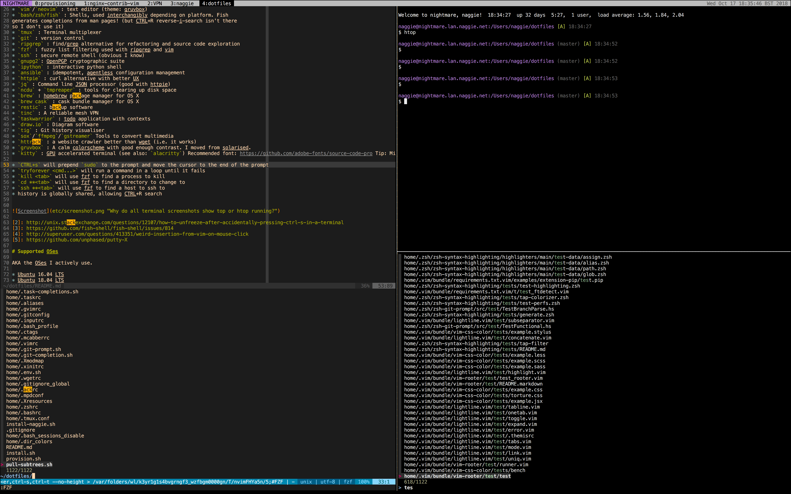

# Noteworthy bindings

## Shell
* `CTRL+p`: search current directory with FZF and launch editor with results. Tab to select multiple.
* `r <string>`: search current directory with ripgrep for files containing `<string>`, filter with FZF and launch editor with results. Tab to select multiple.
* `CTRL+r` history search using fzf
* `tm`: Launch or connect tmux single session. This is automatic if there is already an unconnected session.

See `home/.aliases` for and `bin/` for more handy shortcuts/wrappers.

## Vim
* `CTRL+p` search current directory with FZF and launch editor with results. Tab to select multiple.

## Tmux

Tmux has been configured to follow vim bindings where possible. Check `home/.tmux.conf` for a walk-through.

# Noteworthy features
* Workflows and application configuration profiled for speed. See section on Latency for more information.
* Prompt/hostname colour based on hostname to make it easy to distinguish between hosts.

# Software

General:

* `vim`/`neovim` : text editor (theme: gruvbox)
* `bash/zsh/fish` : Shells, used interchangibly depending on platform. Fish
generates completions from man pages! (but CTRL+R reverse-i-search isn't there
so I don't use it)
* `tmux` : Terminal multiplexer
* `git` : version control
* `ripgrep` : find/grep alternative for refactoring and source code exploration
* `fzf` : fuzzy list filtering used with ripgrep and vim
* `ssh` : secure remote shell (obvious I know)
* `gnupg2`: OpenPGP cryptographic suite
* `ipython` : interactive python shell
* `ansible` : idempotent, agentless configuration management
* `httpie` : curl alternative with better UX
* `jq` : Command line JSON processor (good with httpie)
* `ncdu` + `tmpreaper` : tools for clearing up disk space
* `brew` : homebrew package manager for OS X
* `brew cask` : cask bundle manager for OS X
* `restic` : backup software
* `tinc` : A reliable mesh VPN
* `taskwarrior` : todo application with contexts
* `draw.io` : Diagram software
* `tig` : Git history visualiser
* `sox`/`ffmpeg`/`gstreamer` Tools to convert multimedia
* `httrack` : a website crawler better than wget (i.e. it works)
* `gruvbox` : A calm colorscheme with good enough contrast. I moved from solarised.
* `kitty` : GPU accelerated terminal (see also: `alacritty`) Recommended font: https://github.com/adobe-fonts/source-code-pro Tip: Minimise keyboard repeat delay and maximise keyboard repeat rate for a faster experience. Latency is everything.  NOTE Alacrity/kitty.  

* `CTRL+s` will prepend `sudo` to the prompt and move the cursor to the end of the prompt
* `tryforever <cmd...>` will run a command in a loop until it fails
* `kill <tab>` will use fzf to find a process to kill
* `cd **<tab>` will use fzf to find a directory to change to
* `ssh **<tab>` will use fzf to find a host to ssh to
* history is globally shared, allowing CTRL+R search




[2]: http://unix.stackexchange.com/questions/12107/how-to-unfreeze-after-accidentally-pressing-ctrl-s-in-a-terminal
[3]: https://github.com/fish-shell/fish-shell/issues/814
[4]: http://superuser.com/questions/413351/weird-insertion-from-vim-on-mouse-click
[5]: https://github.com/unphased/putty-X

# Supported OSes

AKA the OSes I actively use.

* Ubuntu 16.04 LTS
* Ubuntu 18.04 LTS
* MacOS (~10.13 High Sierra) (GUI applications too)
* Raspbian Stretch
* ~~Raspbian Jessie~~
* ~~RHEL5~~
* ~~RHEL6~~
* ~~Ubuntu 11.10~~
* ~~Ubuntu 12.04 LTS~~
* ~~Ubuntu 14.04 LTS~~


# One liners

Obviously inspect the script to see what it does before you run it. Note that it
will clobber your settings files.

```bash
curl -sL https://github.com/naggie/dotfiles/raw/master/provision.sh | bash && bash
```

Ubuntu 17.04 does not have curl by default.

```bash
wget -O - https://github.com/naggie/dotfiles/raw/master/provision.sh | bash && bash
```


# Task management

I've tried quite a few TODO systems including simple text files, Todoist,
Trello, Github issues, JIRA, habitica and taskwarrior. The key is
not to use one system for everything. I've settled on:

1. Github issues for personal projects (also using the rest of github)
2. JIRA (with kanban) for work (not by choice but works well if set up with a
   good workflow, slow)
3. Taskwarrior for top level tasks and work logs, with contexts for
   home/work/inbox and detail sometimes tracked separately in (1) and (2).
   Loosely following GTD.
4. Text files to track ideas and proposals

I rely on Taskwarrior to keep a report of what I've done. I kept a log text
file for 3.5 years but stopped because taskwarrior can generate reports.

In my opinion the key for using taskwarrior effectively is reducing noise via
contexts, start/stop, scheduling and tagging. I keep a separate context for
work, home, someday; I defer tasks using the wait/schedule/due attributes. Also
I think it's important not to put tasks on the queue for the sake of it. Only
put tasks on the queue if you need to track them.


# Latency

The lowest possible latency is a target for my workflow and this repository.
Too many user interfaces waste time on stupid animations or are just generally
slow; working with a setup that is perceptually instantaneous is very pleasant
and makes other systems feel irritating to use once you are familiar with the
experience. Beyond the configuration here, here are some other things that
_may_ help reduce latency:

* Use an accelerated terminal such as `kitty` or `alacritty`
* Use a keyboard with a fast polling rate and minimal debounce time. A lot of
  gaming keyboards such as the Corsair K70 are optimised for this. MX Speed
  switches may also help.
* Turn all animations off where possible
* Use a SSD (preferably NVMe m.2 PCI-E based one)
* Adjust keyboard repeat rate to the lowest setting
* Use a monitor with low latency and high refresh rate. Again, gaming monitors
  are usually optimised for this.
* Mitigate [Bufferbloat][6]


[6]: https://www.bufferbloat.net/projects/bloat/wiki/What_can_I_do_about_Bufferbloat/

